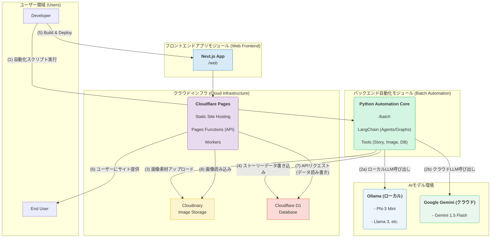

# プロジェクト概要：Lilyco Storybook 自動創作プラットフォーム
- https://dev.novel-comic-site.pages.dev/
- 2025/8/10から始まり、現在開発中

## 1. プロジェクト概観

`lilyco_storybook`は、最先端技術の探求と学習を目的としたフルスタックプロジェクトです。その中核的な目標は、特に「物語絵本」を生成するための自動化されたコンテンツ制作パイプラインを構築することです。

プロジェクト全体は、バックエンドのコンテンツ生成、AIエージェントによるタスクのオーケストレーションから、フロントエンドのコンテンツ表示まで、完全なエンドツーエンドのアプリケーションを構成しています。これは単なるアプリケーションではなく、以下の技術を学び実践するための実験場でもあります：
- 大規模言語モデル（LLM）によるインテリジェントエージェント（Agent）技術
- ローカル環境での大規模言語モデルのデプロイと利用
- 先進的なWebフロントエンドフレームワーク
- サーバーレスアーキテクチャとクラウドサービスの統合

## 2. コアアーキテクチャ

本プロジェクトは、主に二つの核心部分から構成されています：

- **バックエンド自動化コア (`/batch`)**: Pythonで構築され、コンテンツ制作全体の「頭脳」として機能します。指示を受け取り、AIエージェントとワークフローを通じて、物語の生成、画像の生成、リソースのアップロード、そして最終的なデータベースの更新といった多段階のタスクを実行します。

- **フロントエンド表示プラットフォーム (`/web`)**: モダンなWeb技術スタックで構築され、バックエンドで生成された絵本物語をエンドユーザーにエレガントに表示する責任を担います。同時に、バックエンドサービスとのインタラクションのためのインターフェースも含まれています。

### アーキテクチャ図：

## 3. 技術スタック詳細

### バックエンド & AI自動化 (`/batch`)

- **主要言語**: **Python**

- **AIコアフレームワーク**: **LangChain**
  - **インテリジェントエージェント (Agents)**: `AgentExecutor`と`create_tool_calling_agent`を深く利用し、自律的な意思決定とツールの並列呼び出しが可能なエージェントを構築。
  - **グラフワークフロー (Graphs)**: `LangGraph`を探求し、より安定的で制御可能なワークフローを編成。2つのモードを実践：
    1.  **Agentic Loop**: 条件ノード（例：`should_call_tool`）を通じて、エージェントが自律的にループして意思決定を行う。
    2.  **State Machine**: ルーターノードを用いて、所定の順序で実行される決定論的な有限状態マシンワークフローを実現。
  - **モデル統合**: 複数の大規模言語モデル（LLM）の統合方法を実践：
    - `langchain-google-genai`: Googleの**Gemini**シリーズモデルの呼び出しに使用。
    - `langchain-ollama`: ローカルにデプロイされたオープンソースモデルとの対話に使用。

- **ローカルLLM実行環境**: **Ollama**
  - 本プロジェクトのハイライトの一つ。Ollamaを通じて、複数の強力なオープンソースモデルをローカルで実行することに成功し、それらをLangChainエージェントに統合することで、モデルのプライベートなデプロイと無制限の呼び出しを実現。
  - **実践したモデル**: Phi-3, Gemma 2 など。

- **クラウドサービスと外部ツール**:
  - **Cloudinary**: AIによって生成された画像リソースの保存と管理に使用。
  - **Cloudflare D1**: プロジェクトのサーバーレスデータベースとして、最終的な物語と絵本のデータを保存。
  - **Node.js**: Pythonの`subprocess`を通じてNode.jsスクリプトを呼び出し、データベースとの対話を実行。言語を超えた連携能力を実証。

### フロントエンド & Webプラットフォーム (`/web`)

- **コアフレームワーク**: **Next.js (React)**
  - プロジェクトのフロントエンド主体はNext.jsで構築。これは業界をリードするReactフレームワークであり、サーバーサイドレンダリング（SSR）や静的サイト生成（SSG）などの強力な機能を提供。

- **UIスタイリング**: **Tailwind CSS**
  - 人気のユーティリティファーストCSSフレームワークであるTailwind CSSを使用し、モダンでレスポンシブなユーザーインターフェースを迅速に構築。

- **デプロイメントとサービスプラットフォーム**: **Cloudflareフルスタックエコシステム**
  - **Cloudflare Pages**: Next.jsで構築された静的フロントエンドサイトのホスティングとグローバル配信に使用。
  - **Cloudflare Workers**: 独立した高性能なサーバーレスAPIエンドポイントの作成とデプロイに使用。
  - **Cloudflare Pages Functions**: 静的サイトと連携し、サーバーサイドのAPI機能を提供。真のフロントエンド・バックエンド統合型エッジコンピューティングを実現。

### 分野横断技術

- **データベース**: **Cloudflare D1**、ネイティブSQL（`schema.sql`）を記述してテーブル構造を管理。
- **バージョン管理**: **Git / GitHub**、コード管理と（`.github/workflows`を介した）CI/CD自動デプロイに使用。

## 4. コアワークフロー解説

プロジェクトは、完全な自動化コンテンツ制作・デプロイフローを実現しています：
1.  **タスク開始**: ユーザーがコマンドラインまたはフロントエンドUIを通じて物語のテーマを提示。
2.  **物語生成**: バックエンドのLangChainエージェントまたはLangGraphワークフローがテーマを受け取り、最初のツール（LLM）を呼び出して物語のテキストを生成。
3.  **画像生成**: ワークフローが生成された物語のテキストに基づき、画像生成ツールを呼び出し、物語に合った絵本の画像を創造。
4.  **リソースアップロード**: 画像がCloudinaryにアップロードされ、公開アクセス可能なURLが返される。
5.  **データ投入**: 物語のテキスト、画像のURLなどを含む最終データが、Node.jsスクリプトを介してCloudflare D1データベースに書き込まれる。
6.  **静的サイトビルド**: データ更新後、Next.jsフロントエンドアプリケーションがローカル（またはCI/CD経由）で最適化された静的ファイル（HTML/CSS/JS）にビルドされる。
7.  **エッジネットワークへのデプロイ**: ビルドされた静的ファイルが**Cloudflare Pages**にシームレスにデプロイされる。
8.  **グローバルアクセス**: ユーザーは最終的にCloudflare Pagesが提供するグローバルCDNネットワークを通じてこの静的サイトにアクセスし、最新の絵本物語を閲覧する。

このプロジェクトは、多様な現代技術スタックをいかに有機的に組み合わせ、強力で興味深い自動化アプリケーションを構築できるかを存分に示しています。
