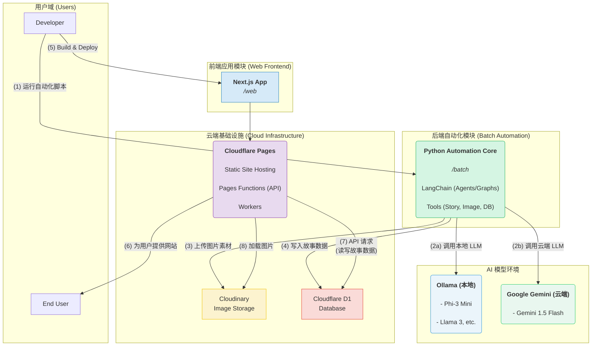

```mermaid
graph TD
    subgraph "用户域 (Users)"
        Dev[Developer]
        EndUser[End User]
    end

    subgraph "后端自动化模块 (Batch Automation)"
        style Script fill:#D5F5E3,stroke:#28B463
        Script("
            <b>Python Automation Core</b><br/>
            <i>/batch</i><br/>
            LangChain (Agents/Graphs)<br/>
            Tools (Story, Image, DB)
        ")
    end

    subgraph "AI 模型环境<br/> "
        style Ollama fill:#EBF5FB,stroke:#3498DB
        style Gemini fill:#E9F7EF,stroke:#2ECC71

        Ollama("
            <b>Ollama (本地)</b><br/>
            - Phi-3 Mini<br/>
            - Llama 3, etc.
        ")
        Gemini("
            <b>Google Gemini (云端)</b><br/>
            - Gemini 1.5 Flash
        ")
    end

    subgraph "云端基础设施 (Cloud Infrastructure)"
        style Cloudinary fill:#FCF3CF,stroke:#F1C40F
        style D1 fill:#FADBD8,stroke:#E74C3C
        style Pages fill:#E8DAEF,stroke:#8E44AD

        Cloudinary[Cloudinary<br/>Image Storage]
        D1[Cloudflare D1<br/>Database]
        Pages("
            <b>Cloudflare Pages</b><br/>
            Static Site Hosting<br/>
            Pages Functions (API)<br/>
            Workers
        ")
    end
    
    subgraph "前端应用模块 (Web Frontend)"
        style NextJS fill:#D6EAF8,stroke:#2E86C1
        NextJS["<b>Next.js App</b><br/><i>/web</i>"]
    end

    %% --- 定义工作流箭头 (使用兼容性更好的标签格式) ---

    Dev -- "(1) 运行自动化脚本" --> Script
    Script -- "(2a) 调用本地 LLM" --> Ollama
    Script -- "(2b) 调用云端 LLM" --> Gemini
    Script -- "(3) 上传图片素材" --> Cloudinary
    Script -- "(4) 写入故事数据" --> D1
    
    Dev -- "(5) Build & Deploy" --> NextJS
    NextJS -- " " --> Pages
    
    Pages -- "(6) 为用户提供网站" --> EndUser
    Pages -- "(7) API 请求<br/>(读写故事数据)" --> D1
    Pages -- "(8) 加载图片" --> Cloudinary
```